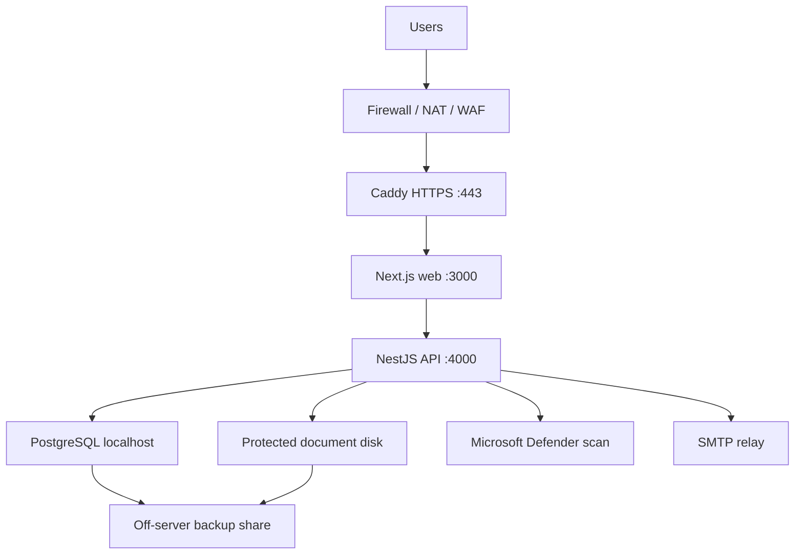

# AuditSphere production deployment guide — Windows Server

This is the authoritative deployment path for the confirmed **Windows-only, on-premises** environment. It installs the application natively as Windows services. Do not install Docker Desktop or run the Linux Compose stack on Windows Server.

## 1. The short answer: a VM and domain are not enough

A VM and domain provide compute and a public name. A client-data production service also needs every item below.

| Requirement | Purpose | Launch rule |
|---|---|---|
| Windows Server 2022 or 2025 | Supported operating system | Required |
| 4+ logical CPUs, 16+ GiB RAM | App, PostgreSQL and malware scanning capacity | Required minimum; load-test before scaling |
| Separate fast data disk, 150+ GiB free | Database, documents and logs | Required; size from expected client volume |
| PostgreSQL 16 or 17 | System of record | Required; bind to localhost only |
| Protected document directory | Evidence and attachments | Required; never place under the web root |
| Microsoft Defender active and current | Synchronous upload scanning | Required; uploads fail closed if scanning fails |
| Caddy and valid DNS | HTTPS and reverse proxy | Required |
| Windows Service Wrapper (WinSW) | Automatic start/restart of Node and Caddy | Required |
| SMTP relay | Invitations and operational email | Required for complete notification behavior |
| Off-server backup share plus protected backup platform | Recovery from VM, disk loss, deletion or ransomware | Required; a second folder on the same VM is not a backup |
| External monitoring and alert recipient | Detect failures | Required |
| Firewall/NAT and preferably WAF/DDoS protection | Limit exposure | Required; publish only TCP 80/443 |
| Named owners, incident process, retention policy and approval | Safe operation of client data | Required |
| Staging/UAT and signed launch checklist | Validate real workflows | Required |

The supplied single-server architecture has no high availability. A VM or PostgreSQL outage causes downtime. The business must sign the accepted RPO/RTO on the readiness checklist, or infrastructure must add redundant application, database and storage capacity before launch.

## 2. Production topology



Only Caddy is public. Ports 3000, 4000 and 5432 must not be reachable from another machine. RDP must be reachable only through the corporate VPN or an approved jump host.

## 3. People required

Do not attempt a client-data go-live alone. Assign these names before starting:

- deployment operator: runs this guide and records evidence;
- Windows/infrastructure administrator: VM, patching, firewall, NAT, DNS and service accounts;
- database owner: PostgreSQL backup, restore and performance;
- security/privacy approver: threat controls, data location, retention and incident handling;
- application owner: decides supported functionality and user access;
- business/UAT owner: signs the end-to-end workflow tests;
- incident contact: receives monitoring alerts and can take the service offline.

## 4. Obtain and record these inputs

- final hostname, for example `auditsphere.company.example`;
- public IP and the VM's static private IP;
- Windows Server edition and build;
- CPU, RAM, OS disk and data disk sizes;
- SMTP host, port, TLS mode, username, password and approved sender;
- off-server UNC backup path and a dedicated backup account;
- monitoring platform and 24/7 or business-hours alert recipient;
- tenant name, tenant slug, currency, timezone and first administrator email;
- agreed RPO (maximum data loss) and RTO (maximum outage);
- retention periods for documents, audit logs, backups and user accounts.

If any launch-gate input is missing, mark it **BLOCKED** in `PRODUCTION_READINESS_CHECKLIST.md`.

## 5. Prepare DNS, network and the VM

1. Patch Windows fully and reboot. Confirm the server clock synchronises with the approved NTP source; TOTP MFA depends on accurate time.
2. Give the VM a static private IP.
3. Create an `A` record for the hostname pointing to the public IP. Create an `AAAA` record only when IPv6 is actually routed to the VM.
4. Configure NAT/load-balancer forwarding for TCP 80 and 443 to the VM. Caddy needs 80/443 for certificate issuance and HTTPS. If corporate PKI terminates TLS upstream, security must document that alternative.
5. Permit outbound DNS, Windows Update/Defender updates, HTTPS certificate traffic and the approved SMTP relay.
6. Restrict RDP to VPN/jump-host administrator addresses. Do not publish PostgreSQL, Node or Caddy's admin port.
7. Create `C:\AuditSphere`, `D:\AuditSphereData` and an application folder `C:\AuditSphere\app`.

Minimum PowerShell checks, run as Administrator:

```powershell
Get-ComputerInfo | Select-Object WindowsProductName, WindowsVersion, OsBuildNumber
Get-CimInstance Win32_ComputerSystem | Select-Object NumberOfLogicalProcessors, TotalPhysicalMemory
Get-Service WinDefend, W32Time
Get-NetTCPConnection -State Listen | Sort-Object LocalPort | Select-Object LocalAddress, LocalPort, OwningProcess
```

## 6. Install prerequisites

Use vendor-approved downloads and record versions and SHA-256 hashes.

1. Install a supported Node.js LTS release (Node 22 or newer) for all users.
2. Open a new elevated PowerShell window and run `corepack enable`, then `corepack prepare pnpm@9.15.4 --activate`.
3. Install PostgreSQL 16 or 17 using the Windows installer. Set it to listen only on `127.0.0.1`; do not add an inbound firewall rule for 5432.
4. Download `caddy.exe` from the official Caddy distribution.
5. Download the current stable WinSW executable from the WinSW release page.
6. Confirm Microsoft Defender is active and security intelligence is current:

```powershell
Get-MpComputerStatus | Select-Object AntivirusEnabled, RealTimeProtectionEnabled, AntivirusSignatureAge
Update-MpSignature
```

If another endpoint-security product puts Defender in passive mode, stop. The present application adapter requires active Microsoft Defender; changing scanner technology requires a tested code/configuration change.

## 7. Copy and verify the release

1. Extract the supplied clean source package into `C:\AuditSphere\app`. Do not carry `node_modules`, `.env`, build output or demo data from another machine.
2. Record the ZIP SHA-256 hash before extraction and the Git commit/release identifier if available.
3. Never use `pnpm db:seed:demo` in production. It creates synthetic presentation accounts and is intentionally excluded from this procedure.

## 8. Generate secrets and finish the environment

Run:

```powershell
Set-Location C:\AuditSphere\app
.\infra\windows\scripts\Initialize-ProductionEnvironment.ps1 `
  -Domain 'auditsphere.company.example' `
  -AcmeEmail 'platform-owner@company.example' `
  -DocumentRoot 'D:\AuditSphereData\documents' `
  -BackupRoot '\\backup01\auditsphere-production'
```

The script creates two protected files: `production.env` for the application and `backup.env` for the read-only database backup account. Open `C:\AuditSphere\config\production.env` as Administrator and replace the three SMTP `CHANGE_ME` values. Do not email or paste either file into tickets or chat. Store encrypted copies in the organisation's approved password/secret vault. Loss of `ENCRYPTION_KEY` makes encrypted MFA secrets unusable; disclosure requires key and session incident response.

Local-account production is intentionally configured with:

- `COOKIE_SECURE=true`;
- `MFA_ENFORCEMENT=all`;
- `MALWARE_SCAN_REQUIRED=true` and `MALWARE_SCANNER=defender`;
- `SWAGGER_ENABLED=false`;
- `AI_ENABLED=false` until a separately approved AI service and data-processing basis exist;
- a 12-hour refresh lifetime.

## 9. Create the database

Install PostgreSQL first. Create the `auditsphere_owner` login and `auditsphere` database with the same password embedded in `DATABASE_URL`. The provided script reads that password from the protected environment file and prompts securely for the PostgreSQL administrator password; it does not place either password in command history:

```powershell
Set-Location C:\AuditSphere\app
.\infra\windows\scripts\Initialize-Database.ps1
```

A database administrator may instead perform this using the organisation's normal privileged workflow.

The current Prisma/RLS design requires the runtime role to own the schema: many tenant-filtered application queries run outside a transaction, while PostgreSQL RLS session context is set only inside explicit transactions. Therefore a separate non-owner runtime role would currently return no rows. Compensating controls are mandatory: PostgreSQL is localhost-only, the credential is restricted to the protected environment file, and all API access is authenticated and tenant-scoped. A future architecture change should put every tenant query inside a transaction-scoped RLS context before reducing runtime database privileges.

## 10. Build and test the release on the target VM

Run these commands on the Windows VM so native dependencies and Prisma's engine match Windows:

```powershell
Set-Location C:\AuditSphere\app
.\infra\windows\scripts\Preflight.ps1 -BeforeServiceInstall
.\infra\windows\scripts\Build-Release.ps1
```

The build script installs locked dependencies, generates Prisma, lints, type-checks, runs unit tests, builds API/web and checks Windows deployment safeguards. Any failure blocks deployment.

## 11. Back up, migrate and bootstrap

For an empty first database, create and verify an initial backup destination, then run:

```powershell
.\infra\windows\scripts\Invoke-DatabaseMigration.ps1 -ConfirmProduction
.\infra\windows\scripts\New-BootstrapAdministrator.ps1 `
  -TenantSlug 'your-organisation' `
  -TenantName 'Your Organisation' `
  -AdminEmail 'named.admin@company.example' `
  -AdminName 'Named Administrator' `
  -Currency 'KES' `
  -Timezone 'Africa/Nairobi'
```

The temporary password is never written to a file. The administrator must change it at first login and then enrol TOTP MFA. Create a second administrator after launch so recovery does not depend on one person.

## 12. Install Windows services

Run:

```powershell
.\infra\windows\scripts\Install-Services.ps1 `
  -WinSwPath 'C:\Installers\WinSW-x64.exe' `
  -CaddyPath 'C:\Installers\caddy.exe'
.\infra\windows\scripts\Start-Services.ps1
.\infra\windows\scripts\Preflight.ps1
.\infra\windows\scripts\Test-Deployment.ps1
```

The scripts install four least-privilege `LocalService` services:

- `AuditSphere.Api`;
- `AuditSphere.Worker`;
- `AuditSphere.Web`;
- `AuditSphere.Caddy`.

Their logs are in `C:\AuditSphere\logs`. Configure the corporate log collector to ingest those files and Windows Defender, System, Application, PostgreSQL and Caddy events. Never ingest `production.env`.

## 13. Configure backups and monitoring

1. Run `Backup-AuditSphere.ps1` manually and verify the custom PostgreSQL dump plus the `documents-current` mirror on a different server. It uses the separate read-only `auditsphere_backup` database role from `backup.env`.
2. Run a full restore rehearsal into a separate non-production database and directory. A successful backup command without a restore test is not sufficient evidence.
3. Enrol the off-server share in the organisation's protected backup platform. Require versioned snapshots or immutable/offline copies on a separate security boundary. The supplied mirror is an operational recovery copy; because `/MIR` propagates document deletions, it is not by itself ransomware or accidental-deletion protection.
4. Schedule `Backup-AuditSphere.ps1` at least nightly under a gMSA/dedicated domain backup account (or the VM computer account under `SYSTEM`) that has read access to the document directory and `backup.env`, and write access only to the backup share. Grant these exact ACLs with the infrastructure owner and test the task under that identity. Do not run it as a personal administrator.
5. Retain at least 35 daily database dumps unless the approved policy says otherwise. Align RPO with backup frequency and protected-snapshot retention.
6. Monitor HTTPS `/health` every minute and `/ready` every five minutes from another machine. Alert on non-200, certificate expiry, disk below 20%, service stopped, PostgreSQL errors, stale Defender signatures, backup age and repeated authentication failures.
7. Send alerts to a named operational rota, not only to the departing developer.

## 14. Human UAT — no client data yet

Using synthetic data only, two different users must test:

1. first login, forced password change, MFA enrolment, logout and MFA login;
2. administrator creates a user, assigns roles, resets another user's password and resets MFA;
3. create audit universe item, risk, control, annual plan and engagement;
4. create program/procedure, workpaper, review note and sign-off flow;
5. create document request, upload a clean file, download it and verify access boundaries;
6. submit/answer a finding and management response through the client portal;
7. generate/export the implemented reports;
8. suspend a user and confirm all access is denied;
9. verify one tenant/user cannot retrieve an object they are not authorised to access;
10. stop Defender temporarily in a controlled window and confirm uploads remain quarantined, then restore protection;
11. execute a backup and a separate restore rehearsal;
12. reboot the VM and confirm all services recover automatically.

Record screenshots, timestamps, test users, result and defect ID. Do not convert failed tests into “accepted” without the named risk owner.

## 15. Go-live sequence

1. Freeze the approved release and record its hash.
2. Confirm every required line in `PRODUCTION_READINESS_CHECKLIST.md` is PASS with evidence.
3. Take and verify a fresh backup.
4. Confirm DNS, certificate and external monitoring.
5. Confirm named incident and rollback owners are available.
6. Allow the approved initial user group only.
7. Monitor logs, authentication, disk, database, upload scans and latency continuously during the presentation/day-one window.
8. Expand users or load only after the application owner signs the day-one review.

## 16. Updates and rollback

Never edit the live source casually. For every release: build/test on staging, back up, stop services, preserve the previous release directory, install the new release, generate Prisma, apply reviewed migrations, start, verify and run UAT smoke tests. Application rollback does not automatically reverse database migrations. If a migration is not backward-compatible, use the approved database restore procedure and accept the resulting data-loss window.

## 17. Official platform references

- Docker states Docker Desktop is not supported on Windows Server: <https://docs.docker.com/desktop/setup/install/windows-install/>
- PostgreSQL Windows installers and supported server versions: <https://www.postgresql.org/download/windows/>
- Microsoft Defender on Windows Server: <https://learn.microsoft.com/en-us/defender-endpoint/microsoft-defender-antivirus-windows-server-configure>
- Microsoft Defender command-line scanning: <https://learn.microsoft.com/en-us/defender-endpoint/command-line-arguments-microsoft-defender-antivirus>
- Caddy automatic HTTPS: <https://caddyserver.com/docs/automatic-https>
- WinSW service wrapper: <https://github.com/winsw/winsw>
