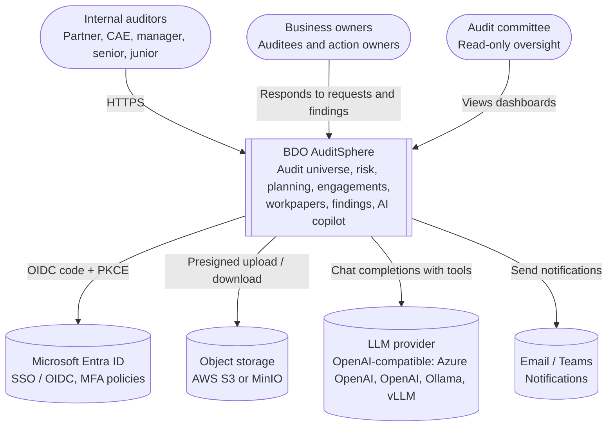
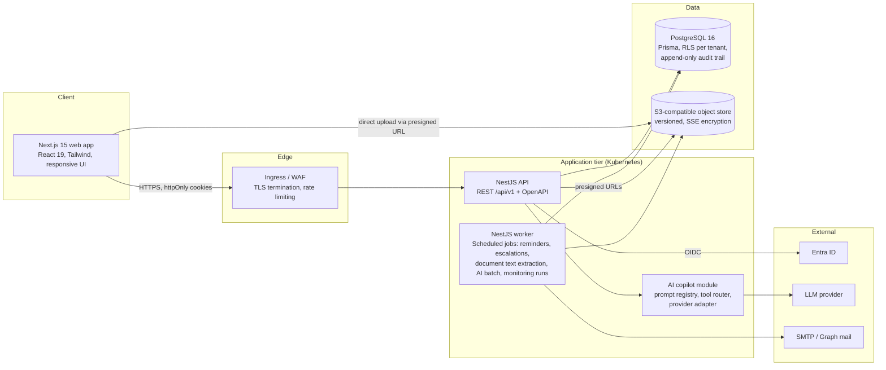
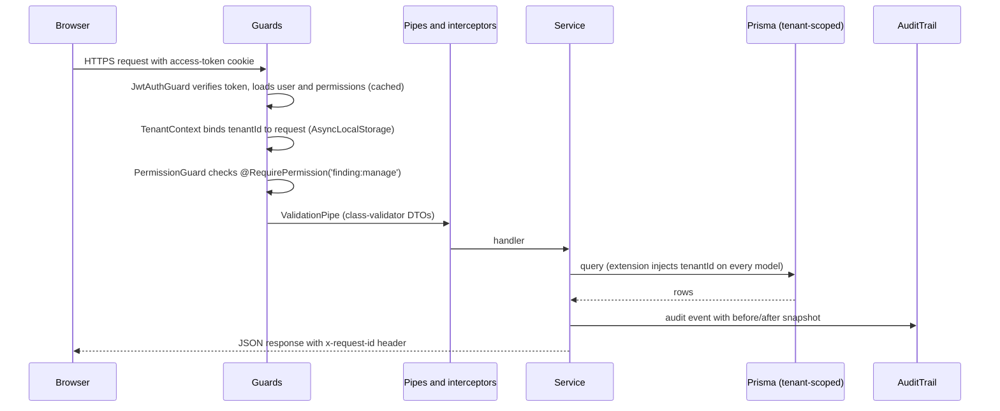
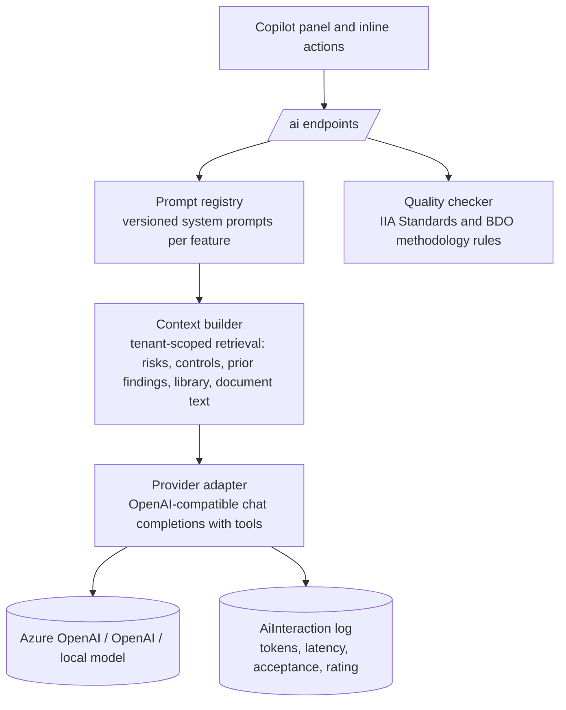

# BDO AuditSphere - System Architecture

BDO AuditSphere is a multi-tenant internal audit operating platform. This document describes
the **as-built architecture**. Future capabilities are kept in [04-roadmap.md](04-roadmap.md),
not presented here as delivered. The database ERD is in [02-erd.md](02-erd.md), user journeys in
[03-user-journeys.md](03-user-journeys.md) and the phased roadmap in [04-roadmap.md](04-roadmap.md).

## 1. Context



## 2. Container view



## 3. Monorepo layout

```
apps/
  api/          NestJS application (REST + OpenAPI, scheduled jobs)
  web/          Next.js application (App Router)
packages/
  db/           Prisma schema, migrations, seed, generated client
  shared/       Domain rules shared by api and web: roles, permission matrix,
                workflow state machines, risk scoring, ageing and escalation rules
infra/
  docker/       docker-compose for local, Dockerfiles for api and web
  k8s/          Kustomize base manifests (deployments, services, ingress, HPA)
.github/workflows/  CI: lint, typecheck, test, build images, migrate, deploy
docs/           Architecture, ERD, journeys, roadmap, ADRs, API docs
```

## 4. Backend design

### 4.1 Module map (NestJS)

| Module | Responsibility |
|---|---|
| `auth` | Local login (argon2id), Entra ID OIDC (authorization code + PKCE), TOTP MFA, rotating refresh tokens, session revocation |
| `access` | Roles, permissions, `@RequirePermission()` guard, record-level portal policies, segregation-of-duties checks |
| `tenancy` | Tenant resolution from JWT, tenant-scoped Prisma client extension, Postgres `SET app.tenant_id` for RLS |
| `audit-trail` | Explicit service-level mutation events and append-only database table |
| `universe` | Entities tree, processes, coverage analysis |
| `risk` | Risks, assessments, scoring models, heat maps, AI risk recommendations |
| `controls` | Controls repository, risk-control matrix, control testing |
| `planning` | Audit plans, plan items, approvals, resource and budget roll-ups, management requests |
| `engagements` | Engagement lifecycle, team, stakeholders, milestones, stage machine with guards |
| `programs` | Audit programmes and steps, instantiate from library |
| `workpapers` | Workpapers, versions, review notes, reviews, sign-off, templates |
| `documents` | Object storage abstraction, presigned upload/download, versions, classification, text extraction |
| `evidence` | Evidence register linked to workpapers, findings and documents |
| `findings` | Findings, recommendations, status machine, reminders, escalation, ageing |
| `requests` | Document request portal, business-user responses |
| `tasks`, `comments`, `notifications` | Cross-cutting collaboration |
| `library` | Knowledge library, frameworks, versioning and approval |
| `time` | Timesheets, charge codes, availability, utilisation |
| `dashboards` | Aggregations for committee, partner and auditor views |
| `ai` | Copilot: prompt registry, provider adapter, tool router, NL search, report writer, quality checker |
| `monitoring` | Connector/rule/alert records and management screens; execution engine remains roadmap |

### 4.2 Request pipeline



### 4.3 Workflow engine

State machines are declared once in `packages/shared/src/workflows.ts` and enforced by
`WorkflowService` in the API. A transition succeeds only when:

1. The transition exists from the current state.
2. The actor holds the transition's permission.
3. Every named guard passes (guards are small functions registered per machine, e.g.
   `signer_is_not_preparer`, `all_workpapers_signed_off`).

Each transition writes a status-history row, an audit-trail row and fan-out notifications.

### 4.4 Security controls

| Requirement | Implementation |
|---|---|
| Authentication | Entra ID OIDC (PKCE) with local fallback; argon2id password hashing; lockout after 5 failures |
| MFA | TOTP (RFC 6238) enforced for audit-function roles; recovery codes; Entra conditional access honoured |
| Sessions | 15-minute access JWT + 30-day rotating refresh token (hashed, family-based reuse detection) in httpOnly, SameSite=Lax cookies |
| RBAC and object access | Role -> permission matrix plus centralized record-level policies for portal/business users |
| Segregation of duties | Preparer cannot review or sign off own workpaper; finding validator cannot be action owner; enforced in workflow guards |
| Tenant isolation | `tenantId` on every table, Prisma extension injects filters, Postgres RLS policies keyed on `current_setting('app.tenant_id')` |
| Encryption | TLS in transit; storage encryption at rest; S3 SSE; field-level AES-256-GCM for MFA secrets and connector configs |
| Document access | Presigned URLs with 5-minute TTL; classification checks (`document:restricted`); download events in audit trail |
| Audit logs | Append-only `AuditTrail` table, DB trigger prevents UPDATE and DELETE, request id correlation |
| Hardening | Helmet, strict CORS, rate limiting, input validation, CSP on web app |

## 5. Frontend design

- Next.js App Router with client components for interactive editors and server-side
  rendering of the shell.
- Design language: Microsoft 365 and Fluent-inspired, shadcn/ui primitives, BDO red accent
  on neutral greys, 8-pt spacing grid.
- Global command palette (Ctrl+K) for search-everywhere and keyboard navigation.
- Data tables with filter chips, saved views, drag-and-drop ordering of programme steps and
  workpapers.
- Responsive web application. Offline/PWA synchronization is not implemented and remains a
  possible roadmap item.

## 6. AI layer



Every AI output is a suggestion the user accepts, edits or rejects; acceptance is logged for
quality tracking. Prompts never include data outside the caller's tenant. The provider is
selected by `AI_BASE_URL`, so a local model (Ollama, vLLM) is a configuration change.

## 7. Deployment

- Docker images for `api` and `web` (multi-stage, non-root runtime).
- Kubernetes: separate Deployments for api, worker and web; HPA on CPU; PodDisruptionBudgets;
  Secrets from an external secret store; managed PostgreSQL and S3-compatible storage.
- CI (GitHub Actions): lint, typecheck, unit tests, integration tests against a Postgres service
  container, build and push images, `prisma migrate deploy` job, rollout.
- Observability: pino structured logs with request id, `/health` and `/ready` probes.

## 8. Key architecture decisions

See `docs/adr/` for full records.

| ADR | Decision |
|---|---|
| 001 | PostgreSQL + Prisma with tenant column and RLS rather than schema-per-tenant |
| 002 | REST is the implemented API; GraphQL remains an optional roadmap decision |

## 9. Explicitly unimplemented roadmap items

Redis-backed queues/cache, GraphQL, offline/PWA synchronization, ERP connector execution,
Azure Blob native storage, distributed tracing and a production metrics stack are not part of
the current implementation. Their presence in roadmap or historical documents is not evidence
that they are available in a deployment.
| 003 | Workflow state machines declared in shared package, enforced server-side |
| 004 | OpenAI-compatible adapter so any provider or local model can be used |
| 005 | Documents stored in object storage with presigned URLs; DB stores metadata only |
