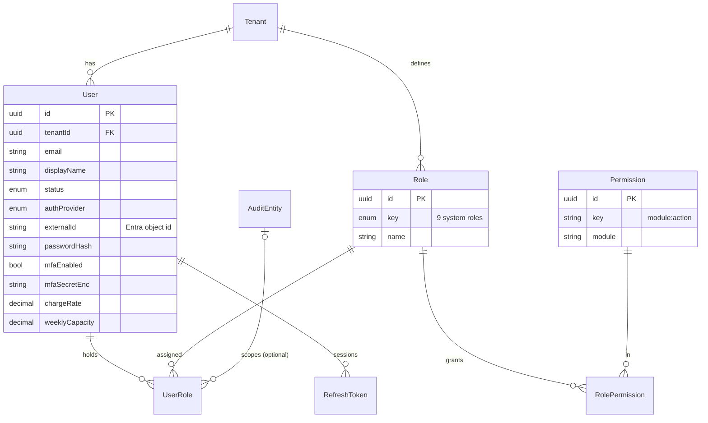
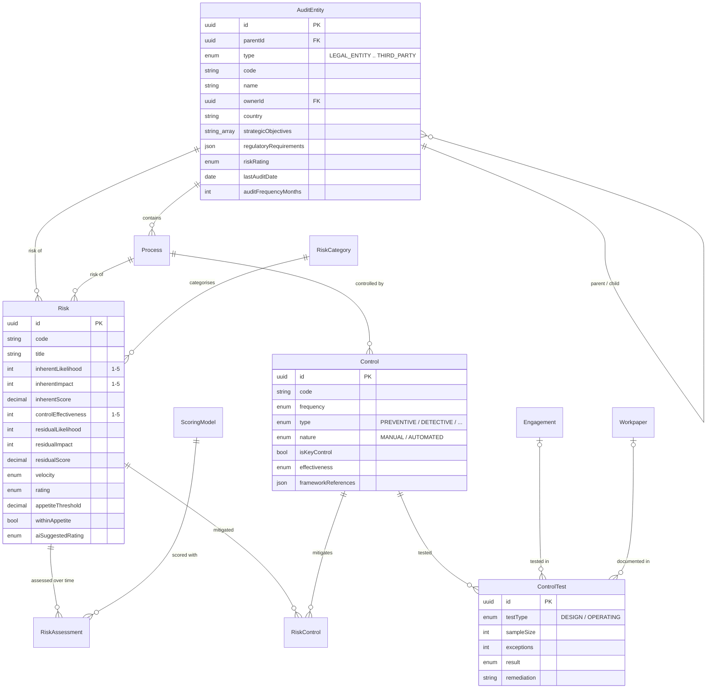
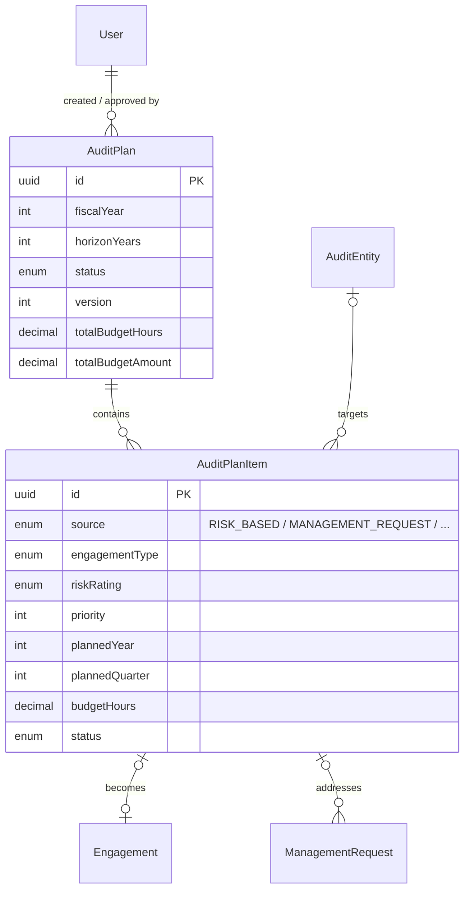
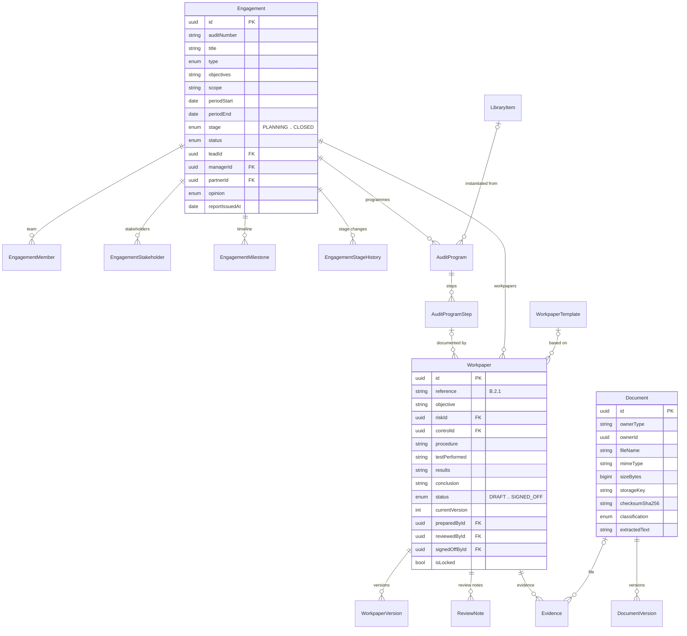
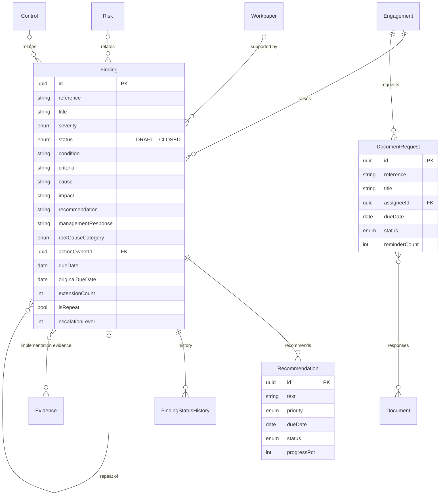
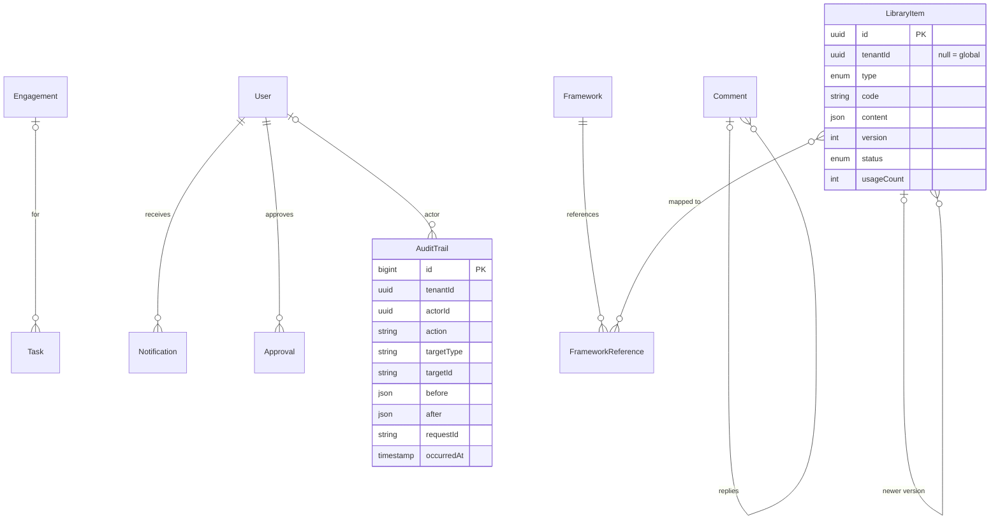
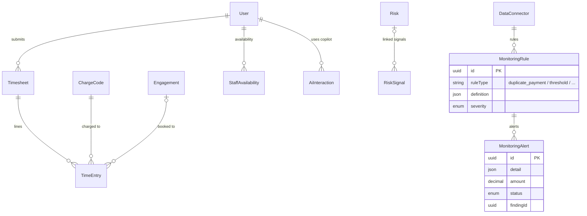

# BDO AuditSphere - Entity Relationship Diagram

Source of truth: `packages/db/prisma/schema.prisma`. Every business table carries `tenantId`.
Diagrams are grouped by module for readability; foreign keys to `User` are shown only where
they carry business meaning.

## 1. Identity and access



## 2. Audit universe, risk and controls



## 3. Planning



## 4. Engagement lifecycle



## 5. Findings and remediation



## 6. Collaboration, governance and library



## 7. Time, AI and continuous monitoring



## 8. Knowledge graph

The graph module traverses existing relations rather than a separate store:

```
Risk --RiskControl--> Control --AuditProgramStep--> Procedure --Workpaper--> Evidence
     \--Finding.riskId--> Finding --Recommendation--> Recommendation
```

Exposed through `/api/v1/graph/risk/:id` in Phase 1 and GraphQL in Phase 3.
