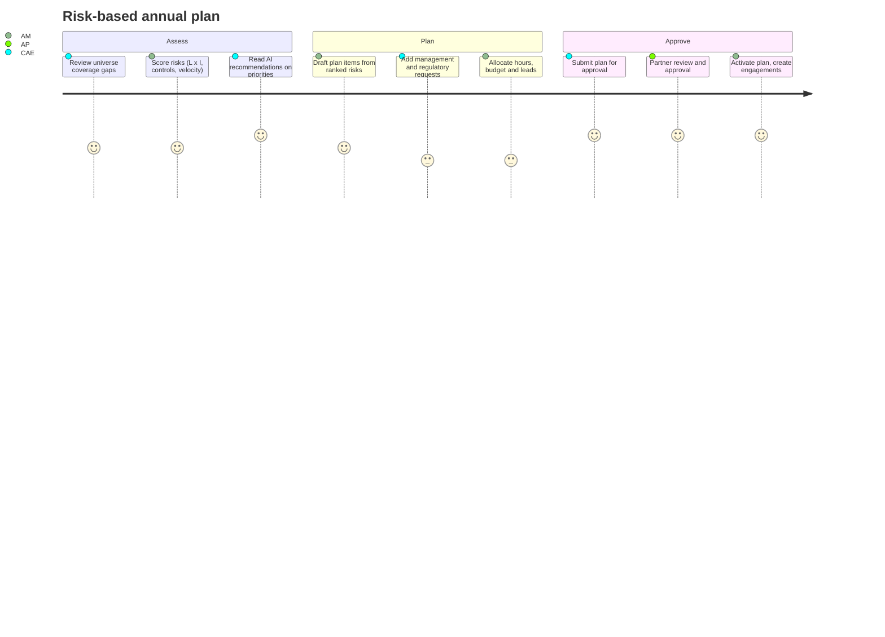

# BDO AuditSphere - User Journeys

Roles: Global Administrator (GA), Audit Partner (AP), Chief Audit Executive (CAE), Audit
Manager (AM), Senior Auditor (SA), Junior Auditor (JA), Business Owner (BO), Management
Reviewer (MR), Audit Committee Viewer (ACV).

## J1. First login and workspace setup (GA, CAE)

1. GA signs in with Microsoft Entra ID; on first login the tenant is provisioned from the
   Entra tenant id and the GA role is granted to the configured admin group.
2. GA invites users or maps Entra groups to AuditSphere roles; MFA is enforced for all
   audit-function roles (TOTP if Entra MFA is not asserted in the token).
3. CAE configures the scoring model (scales, weights, thresholds, appetite) and charge codes.
4. CAE imports the audit universe from Excel or builds it in the tree editor.

Outcome: tenant ready, universe populated, roles assigned, audit trail records every step.

## J2. Annual risk assessment and plan (CAE, AM, AP)

Key screens: risk heat map, coverage analysis (universe vs last-audit dates), plan builder
(drag items between quarters), resource capacity bar per auditor, approval dialog.

## J3. Engagement lifecycle (AM, SA, JA, AP)

1. **Planning.** AM opens the engagement created from the plan item, completes objectives,
   scope, period, team and milestones. Copilot drafts scope from linked risks.
2. **Risk assessment.** SA links universe risks and controls and records the engagement-level
   assessment; the risk-control matrix is generated.
3. **Programme.** SA instantiates an audit programme from the library (for example Procurement
   under COSO), edits steps, assigns to JA; AM approves the programme.
4. **Fieldwork.** JA works each step in its workpaper: procedure, test performed, evidence
   uploaded through a presigned URL or linked from a document request, conclusion. Copilot
   summarises evidence and flags exceptions. JA marks the workpaper as prepared.
5. **Review.** SA reviews and raises review notes; JA addresses them; SA approves; AM signs off.
   Segregation of duties is enforced: the preparer can never review or sign off their own work.
6. **Reporting.** SA drafts findings (condition, criteria, cause, impact, recommendation);
   Copilot proposes professional wording and the executive summary. Findings go to BO for
   management response and agreed dates. AP issues the report.
7. **Follow-up.** Action owners implement; reminders fire 14, 7 and 1 days before due and weekly
   after; escalation to manager, CAE and committee by age. SA validates and closes findings.
8. **Closure.** AM closes the engagement when all findings are closed or risk-accepted.

## J4. Business owner responds (BO)

1. BO receives an email with a deep link and signs in with Entra ID.
2. The portal shows *My requests* and *My actions*. BO uploads evidence to a document request,
   adds a note and submits; the auditor accepts or returns it with a reason.
3. On a finding, BO enters the management response, action owner and target date, then agrees.
4. During implementation BO updates progress, attaches evidence and requests validation.

## J5. Audit committee oversight (ACV, AP)

1. ACV opens the Audit Committee dashboard: overall risk profile heat map, plan progress,
   key and repeat findings, overdue actions by ageing bucket, risk trends over quarters.
2. Drill-through is read-only; export to PDF for the committee pack.

## J6. Partner portfolio (AP)

Portfolio overview across engagements: stage, budget versus actual hours, utilisation by staff,
engagement profitability (charge rate times hours versus budget amount), overdue milestones.

## J7. Auditor daily work (SA, JA)

The Auditor dashboard lists assigned steps, workpapers with open review notes, pending
reviews, deadlines this week and timesheet status. Ctrl+K opens search-everywhere; typing
`>` runs commands such as "new finding" or "go to engagement 2026-014".

## J8. Natural language audit search (all audit roles)

"Show all procurement findings in Kenya closed late" is mapped by Copilot to a structured query
(process = Procurement, entity country = KE, status = CLOSED, closedAt after dueDate), executed
tenant-scoped, and returned as a table with a link to the saved filter.

## J9. Continuous monitoring (AM, SA), Phase 3 roadmap (not implemented)

1. AM configures a connector (D365 GL through API or CSV upload) and enables rules: duplicate
   payments, weekend postings, split invoices under approval threshold, SoD conflicts.
2. Rules run on schedule; alerts land in the Monitoring queue with severity and amount.
3. SA investigates, marks false positive, or confirms and raises a finding linked to the alert.

## J10. Field inspection on mobile (SA), Phase 4 roadmap (not implemented)

1. SA opens the PWA offline at a branch, selects the engagement and inspection checklist.
2. Photos and voice notes are captured against checklist items and queued in IndexedDB.
3. On reconnect the queue syncs to the document store and the evidence register.
