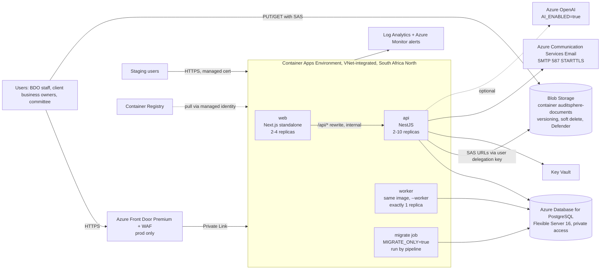

# AuditSphere: developer brief for online deployment on Microsoft Azure

Version 1.0, 9 September 2026. Audience: the developer(s) who will take AuditSphere from
the single-machine pilot to a hosted service, plus the IT/Azure administrator who owns the
subscription, DNS and Entra ID. Two environments are in scope: **staging** (UAT, client
demos) and **production** (live use). The brief states what to build, what to change in
the code, what to provision, and how to prove it works. Every claim about the code refers
to the repository as of this date; every Azure statement should be re-verified against
current Microsoft documentation before purchase.

## 0. Summary

- Host on **Azure Container Apps** in **South Africa North** (paired region South Africa
  West), with Azure Database for PostgreSQL Flexible Server 16, Azure Blob Storage for
  documents, Key Vault for secrets, Azure Container Registry for images, Log Analytics for
  logs, Azure Communication Services for email, and (production only) Azure Front Door
  Premium with WAF in front. Staging is a smaller copy without Front Door.
- The repository is already close to deployable: Dockerfiles, migrations, a CI pipeline that
  builds images on tags, and Kubernetes manifests. Four code changes are required before
  Azure will work: an **Azure Blob storage driver** (the code only speaks S3), a **split of
  the seed** into reference data and demo data plus a first-admin bootstrap, an **email
  transport that does not depend on basic SMTP authentication**, and a **deploy pipeline
  targeting Container Apps** instead of `kubectl`. Three hardening items are strongly
  recommended before real client data (section 4.7).
- Indicative effort: 4 to 6 weeks elapsed for one developer with IT support, of which
  about 12 to 16 developer days are code and pipeline work and the rest is provisioning,
  UAT and go-live. Indicative run cost: roughly USD 450 to 600 per month for production
  without Front Door Premium, 800 to 1,000 with it, plus about 150 to 250 for staging
  (section 9.4; validate with the Azure pricing calculator).

## 1. What the repository already provides

| Area | What exists | Where |
|---|---|---|
| Images | Multi-stage Dockerfiles for the API/worker (one image, `--worker` flag) and the web app (Next.js standalone, `NEXT_PUBLIC_API_URL` baked at build) | `infra/docker/*.Dockerfile`, `infra/docker/api-entrypoint.sh` |
| Migrations | Prisma migrations applied by `prisma migrate deploy`; `MIGRATE_ONLY=true` runs them and exits (designed for a one-shot job) | `packages/db/prisma/migrations`, entrypoint |
| CI | On push to `main` and tags `v*`: install, typecheck, lint, migrate + seed against a Postgres service, migration drift check, unit and API e2e tests, build. On `v*` tags: build and push both images to GHCR with semver, `sha-` and `latest` tags | `.github/workflows/ci.yml` |
| Deploy | Manual workflow: pins image tags with Kustomize, runs the migrate Job, applies the overlay, waits for rollouts, smoke-checks `/api/v1/ready`. Targets any cluster via a `KUBECONFIG` secret | `.github/workflows/deploy.yml` |
| Kubernetes | Base manifests (api, worker, web, migrate Job, ConfigMap, Secret template, Services, ingress-nginx Ingress with security headers and rate limiting, HPA, PDB, non-root read-only containers) and a production overlay with hostnames `auditsphere.bdo-ea.com` | `infra/k8s/base`, `infra/k8s/overlays/production` |
| Health | `GET /api/v1/health` (liveness) and `GET /api/v1/ready` (readiness: database and storage reachable) | `apps/api/src/health` |
| Config | Zod-validated environment schema; invalid config fails fast at start | `apps/api/src/config/env.schema.ts` |
| Storage | Pluggable `StorageDriver` interface with `local` and `s3` drivers; browser uploads and downloads use presigned URLs (5-minute TTL); keys are `<tenantId>/<uuid>` | `apps/api/src/storage` |
| Security | Entra ID OIDC with local fallback, TOTP MFA, argon2id, rotating refresh tokens, `trust proxy` enabled, Helmet/CORS/rate limiting, AES-256-GCM for stored secrets, append-only audit trail with DB trigger | architecture doc s4.4, `apps/api/src/app.setup.ts`, `auth/` |
| Docs | Deployment guide (environments, env reference, Entra app registration, S3 policy, hardening checklist), infra README | `docs/05-deployment.md`, `infra/README.md` |

Gaps found while preparing the pilot and this brief:

1. Object storage is S3-only. Azure Blob Storage has no S3 API, so a driver is needed
   (section 4.1). The Kubernetes overlay currently points at an AWS bucket in `af-south-1`.
2. The base Compose file never sets `STORAGE_DRIVER`; the API silently uses the `local`
   driver inside the container. Not a production issue, but fix it (section 4.4).
3. The seed is all-or-nothing: reference data (permissions, roles, frameworks, methodology
   library, templates, scoring model) and the fictional Baraka demo data with nine demo
   accounts sharing one well-known password are created together. Production must never run
   it as-is (section 4.2).
4. Email is sent by nodemailer over SMTP with username/password. The Kubernetes ConfigMap
   points at `smtp.office365.com:587`. Microsoft is retiring basic authentication for SMTP
   client submission (currently: disabled at the end of December 2026 with a temporary
   opt-out, final removal to be announced in 2027), so a go-live in 2026 needs a different
   transport (section 4.3).
5. There is no administrator "reset password" or "resend invitation" action, and no
   self-service reset without email. Operationally painful once there are 30 users; see
   section 4.7.
6. Within one organisation the portal filters by person, not by client entity
   (`request:read` and `finding:read` are tenant-wide). Documented as a hardening item;
   relevant if one instance serves several client companies (section 4.7 and 15).
7. Redis appears in the architecture diagram but nothing in the quick start or Compose
   stack uses it; rate limiting is in-process. Acceptable at this scale (section 15).

## 2. Target architecture



Design decisions and why:

- **Container Apps rather than AKS.** The repo's Kubernetes manifests are good, but AKS
  brings a cluster to patch, ingress-nginx, cert-manager and metrics-server to operate, and
  node costs. Container Apps gives the same shape (three apps, one job, scaling rules,
  managed certificates, VNet integration, managed identity) with no cluster management,
  and is the cheaper fit for a workload of this size. The Dockerfiles, migrations and CI
  image build are reused unchanged; the Kustomize overlays are replaced by Bicep. If the
  firm later standardises on AKS, the existing manifests remain the fallback and the
  application does not change.
- **Path routing.** Production: Front Door routes `/api/*` to the `api` app and everything
  else to `web`, exactly as the repo's Ingress does, so browser calls avoid the double hop.
  Staging: only `web` is exposed; `web` proxies `/api/*` to the internal `api` app through
  the built-in Next.js rewrite (`API_INTERNAL_URL`). Both keep `NEXT_PUBLIC_API_URL=/api/v1`
  and same-origin cookies.
- **Documents go straight to Blob Storage** with short-lived SAS URLs, the Azure equivalent
  of the presigned URLs the code already uses. No document bytes flow through the API
  except the worker's text extraction.
- **One worker replica**, always. Reminders, escalations and extraction jobs are written
  as single-instance schedulers.
- **Private by default.** Postgres, Key Vault and the storage account are reachable only
  from the VNet (private endpoints); the Container Apps environment is internal in
  production and reached through Front Door Private Link; staging uses an external
  environment with IP restrictions if the firm wants it reachable only from the office.

### Environment matrix

| | Staging | Production |
|---|---|---|
| Hostname | `auditsphere-staging.bdo-ea.com` | `auditsphere.bdo-ea.com` |
| Entry point | Container Apps ingress on `web`, managed certificate | Front Door Premium, WAF (managed rule set + rate limit), Private Link to environment |
| Container Apps environment | Consumption, external ingress, VNet-integrated | Workload profiles (Consumption profile), internal ingress, VNet-integrated |
| api / web / worker replicas | 1 / 1 / 1 (api and web min 1, scale to 3) | api 2-10, web 2-4, worker 1 |
| PostgreSQL | Burstable B2ms, 64 GB, 7-day PITR, no HA | General Purpose D2ds_v5 (2 vCPU, 8 GB), 128 GB, 35-day PITR, geo-redundant backup, zone-redundant HA (decision 15.3) |
| Storage account | Standard LRS, versioning, 30-day soft delete | Standard ZRS (GRS if the firm wants cross-region copies), versioning, 90-day soft delete, lifecycle rule for old versions, Defender for Storage malware scanning |
| Secrets | Key Vault `kv-auditsphere-stg` | Key Vault `kv-auditsphere-prod`, purge protection on |
| Email | ACS Email, Azure-managed domain or `staging` subdomain | ACS Email, custom domain (`no-reply@bdo-ea.com` or a subdomain), SPF and DKIM |
| Entra app registration | `BDO AuditSphere staging` | `BDO AuditSphere production`, assignment required, Conditional Access requires MFA |
| AI provider | `AI_ENABLED=false` (local drafting mode) until a provider is approved | Decision 15.5 |
| Data | Anonymised or demo data only; may run `seed:demo` | Reference seed + bootstrap admin only; never demo data |
| Logs | Log Analytics, 30 days | Log Analytics, 90 days, archive export to storage for longer retention |

## 3. Azure resource inventory

Naming below is a suggestion; follow the firm's convention if one exists. One resource
group per environment, one subscription (or one per environment if IT prefers).

| Resource | Staging | Production | Notes |
|---|---|---|---|
| Resource group | `rg-auditsphere-stg-san` | `rg-auditsphere-prod-san` | Region `southafricanorth` |
| Virtual network | `vnet-auditsphere-stg` 10.20.0.0/16 | `vnet-auditsphere-prod` 10.10.0.0/16 | Subnets: `snet-aca` (/23, delegated to `Microsoft.App/environments`), `snet-postgres` (/28, delegated to `Microsoft.DBforPostgreSQL/flexibleServers`), `snet-privateendpoints` (/27) |
| Private DNS zones | `privatelink.postgres.database.azure.com`, `privatelink.blob.core.windows.net`, `privatelink.vaultcore.azure.net` | same | Linked to the VNet |
| Container Registry | `acrauditsphere` (Basic) | shared with staging | Images pushed by CI; apps pull with managed identity (`AcrPull`) |
| Container Apps environment | `cae-auditsphere-stg` | `cae-auditsphere-prod` (internal) | Log Analytics linked; zone redundancy on for prod |
| Container apps | `ca-api`, `ca-web`, `ca-worker` | same | System-assigned managed identity on `ca-api` and `ca-worker` for Key Vault, Storage and ACR |
| Container Apps job | `caj-migrate` | same | Manual trigger, API image, env `MIGRATE_ONLY=true`, `RUN_MIGRATIONS` unset, timeout 600 s, parallelism 1 |
| PostgreSQL Flexible Server | `psql-auditsphere-stg` | `psql-auditsphere-prod` | Version 16, private access, `require_secure_transport=on`, `azure.extensions` includes `PG_TRGM` (the only extension the migrations create); admin login in Key Vault; app role `auditsphere_app` owns the schema |
| Storage account | `stauditspherestg` | `stauditsphereprod` | Container `auditsphere-documents`; private endpoint for the API; **public endpoint stays enabled for browser SAS access** with CORS restricted to the app hostname; HTTPS only, TLS 1.2 minimum, shared-key access disabled (SAS via user delegation key only) |
| Key Vault | `kv-auditsphere-stg` | `kv-auditsphere-prod` | RBAC model; `Key Vault Secrets User` to the app identities; secrets listed in section 5 |
| Log Analytics | `log-auditsphere-stg` | `log-auditsphere-prod` | Container console and system logs; alert rules in section 9 |
| Communication Services + Email | `acs-auditsphere` | shared | Email domain resource per sender domain; SMTP username resource bound to an Entra app (section 4.3) |
| Front Door Premium | none | `afd-auditsphere` | Endpoint `auditsphere.bdo-ea.com`, origin group with Private Link to the environment, routes `/api/*` -> `ca-api`, `/*` -> `ca-web`, WAF policy (Microsoft default rule set, bot protection, rate-limit rule 300 requests/minute per client on `/api/v1/auth/*`), HSTS via response header rule |
| Azure OpenAI (optional) | none | `oai-auditsphere` | Only if decision 15.5 approves; deployment name becomes `AI_MODEL` |
| Defender for Cloud | Defender for Storage (malware scanning) on both | plus Defender for Databases if budget allows | Section 4.7 explains how the app consumes scan results |

Everything above should be expressed in Bicep under `infra/azure/` (section 4.6) so
staging and production differ only by a parameter file.

## 4. Code and repository changes

Each item has a definition of done. Estimates are developer days for someone who knows
the codebase.

### 4.1 Azure Blob storage driver (2 to 3 days)

The `StorageDriver` interface (`apps/api/src/storage/storage.driver.ts`) is the whole
contract: `init`, `healthCheck`, `presignUpload`, `presignDownload`, `putObject`,
`getObject`, `deleteObject`, `stat`, and the `name` literal. Implement
`AzureBlobStorageDriver` in `apps/api/src/storage/azure-blob.driver.ts` with
`@azure/storage-blob` and `@azure/identity`:

- Authenticate with `DefaultAzureCredential` (managed identity in Azure, developer
  credentials locally). No account keys anywhere.
- `presignUpload`: return a **user delegation SAS** for the blob with `create` and `write`
  permissions, 5-minute expiry (reuse `PRESIGN_TTL_SECONDS`), `method: 'PUT'`, and headers
  `x-ms-blob-type: BlockBlob` plus `Content-Type`. The browser already sends whatever
  headers the driver returns.
- `presignDownload`: user delegation SAS with `read`, `rscd` (content disposition
  `attachment; filename=...`) and `rsct` (content type) so downloads keep the file name.
- `putObject`/`getObject`/`deleteObject`/`stat`: `BlockBlobClient.uploadData`,
  `download`, `deleteIfExists`, `getProperties` (size and, if present, the `Content-MD5` or
  a stored SHA-256 metadata value; the existing `stat` returns `checksumSha256` optionally).
- `healthCheck`: `ContainerClient.exists()`; `/ready` reports storage down when false.
- Keys stay `<tenantId>/<uuid>`; `assertValidKey` is reused.
- Cache the user delegation key for its lifetime (request a key valid for one hour and
  reuse it) rather than fetching one per SAS.

Configuration: extend `STORAGE_DRIVER` to `z.enum(['local', 's3', 'azure'])`, the
driver `name` union, and `storage.module.ts` factory; add `AZURE_STORAGE_ACCOUNT`,
`AZURE_STORAGE_CONTAINER` (default `auditsphere-documents`) and optional
`AZURE_STORAGE_CONNECTION_STRING` for local testing with Azurite. Document them in
`docs/05-deployment.md` section 2 and `.env.example`.

Storage account prerequisites (Bicep): CORS rule on the Blob service allowing `PUT`, `GET`,
`HEAD` from `https://auditsphere.bdo-ea.com` (and the staging host on staging) with headers
`*` and `x-ms-*` exposed; versioning and soft delete on; the app identity holds
`Storage Blob Data Contributor` on the container and `Storage Blob Delegator` on the
account (needed to mint user delegation keys).

Definition of done: the existing storage unit tests pass against Azurite in CI (add an
Azurite service container, as the CI already does for Postgres); a document uploaded from
the browser in staging lands in the container under `<tenantId>/<uuid>`, downloads with
its original name, the worker extracts text from it, and `/api/v1/ready` flips to not-ready
when the container is unreachable.

### 4.2 Seed split and first-admin bootstrap (1 to 2 days)

`packages/db/prisma/seed.ts` runs, in order: permissions, tenant, roles, users, frameworks,
workpaper templates, risk config, charge codes, universe, risks and controls, library, plan,
engagements, findings, requests. Split it into:

- `pnpm db:seed:reference` — permissions, roles, frameworks and references, workpaper
  templates, scoring model and risk categories, the published methodology library. Tenant
  creation is parameterised (`TENANT_SLUG`, `TENANT_NAME`) instead of hard-coded `bdo-ea`.
  Idempotent; safe to rerun on every deploy (the CI already treats the seed as idempotent).
- `pnpm db:seed:demo` — everything else (Baraka universe, engagements, demo users). Refuses
  to run when `NODE_ENV=production` or when `ALLOW_DEMO_SEED` is not `true`.
- `pnpm db:bootstrap-admin --email <email> --name <name>` — creates one Global
  Administrator with a generated one-time password printed once (or, when Entra is
  configured, creates the user with the Entra object id so first sign-in maps to the
  admin role). Everything after that happens through Admin > Users.

Keep `pnpm db:seed` as an alias for reference + demo so local development and CI are
unchanged. Definition of done: a fresh database with `seed:reference` + `bootstrap-admin`
lets the administrator sign in, invite users and create an audit universe; `seed:demo`
aborts in production.

### 4.3 Email transport (1 day)

Keep nodemailer but stop relying on Exchange Online basic SMTP authentication. Use
**Azure Communication Services Email over SMTP**: host `smtp.azurecomm.net`, port 587,
STARTTLS (TLS 1.2+), username = the SMTP Username resource bound to an Entra application
that holds the *Communication and Email Service Owner* role on the ACS resource, password
= that application's client secret. This maps directly onto the existing `SMTP_HOST`,
`SMTP_PORT`, `SMTP_USER`, `SMTP_PASS`, `SMTP_FROM` variables, so the only code change is in
`mail.service.ts`: today `createTransport` sets `secure: port === 465` and relies on
nodemailer's opportunistic STARTTLS on 587; add `requireTLS: true` so a downgrade is
refused, and log the transport mode at start-up. Verify the sender domain in ACS (TXT), publish SPF and DKIM records
for the sending subdomain, and set `SMTP_FROM` to an address on that domain.

Alternative if the firm prefers Exchange: nodemailer with `XOAUTH2` against an Entra app
granted `SMTP.Send` (more moving parts, and Microsoft's own direction is OAuth or Graph).
Either way, note Microsoft's timeline: basic SMTP authentication is scheduled to be disabled
at the end of December 2026 with a temporary admin opt-out, and a final removal date is
expected to be announced in 2027, so `smtp.office365.com` with a password is not a
go-live option.

Definition of done: invitation, reminder and escalation emails from staging arrive in a
BDO mailbox with passing SPF/DKIM; the worker log shows deliveries; bounces are visible in
ACS insights.

### 4.4 Configuration and small fixes (0.5 day)

- Add `STORAGE_DRIVER: ${STORAGE_DRIVER:-s3}` to `x-api-env` in
  `infra/docker/docker-compose.yml` and make `S3_ENDPOINT` overridable, so the Compose
  stack really uses MinIO. Add the pilot's `.dockerignore` permanently.
- Add `AZURE_*` keys to `env.schema.ts`, `.env.example`, the Kubernetes ConfigMap/Secret
  templates (for completeness) and `docs/05-deployment.md`.
- `CORS_ORIGINS` and `WEB_BASE_URL` become per-environment Bicep parameters.
- Confirm `app.setup.ts` `trust proxy` is `1` hop for staging (Container Apps ingress) and
  `2` for production (Front Door then Container Apps ingress), or switch to trusting the
  `X-Forwarded-For` chain Container Apps provides; rate limiting keys on client IP and must
  not see the proxy's address.

### 4.5 CI/CD for Container Apps (1 to 2 days)

Keep `ci.yml` as it is, with two changes: push images to ACR instead of (or in addition
to) GHCR, and log in with **OpenID Connect federated credentials** (`azure/login` with a
federated identity on a user-assigned managed identity or app registration) so no
long-lived secrets live in GitHub. Replace `deploy.yml` with a Container Apps version:

```yaml
# .github/workflows/deploy-aca.yml (outline)
on:
  workflow_dispatch:
    inputs: { environment: {type: environment, required: true}, image_tag: {type: string, required: true}, skip_migrations: {type: boolean, default: false} }
jobs:
  deploy:
    environment: ${{ inputs.environment }}      # staging | production (production requires reviewers)
    permissions: { id-token: write, contents: read }
    steps:
      - uses: azure/login@v2
        with: { client-id: ${{ vars.AZURE_CLIENT_ID }}, tenant-id: ${{ vars.AZURE_TENANT_ID }}, subscription-id: ${{ vars.AZURE_SUBSCRIPTION_ID }} }
      - name: Pre-deploy database backup (production only)
        if: inputs.environment == 'production'
        run: az postgres flexible-server backup create -g $RG -n $PG --backup-name pre-${{ inputs.image_tag }}
      - name: Migrate
        if: ${{ !inputs.skip_migrations }}
        run: |
          az containerapp job update -g $RG -n caj-migrate --image $ACR/auditsphere-api:${{ inputs.image_tag }}
          az containerapp job start  -g $RG -n caj-migrate
          # poll `az containerapp job execution list` until Succeeded; fail the workflow on Failed and print logs from Log Analytics
      - name: Roll out api, worker, web
        run: |
          for app in ca-api ca-worker; do az containerapp update -g $RG -n $app --image $ACR/auditsphere-api:${{ inputs.image_tag }}; done
          az containerapp update -g $RG -n ca-web --image $ACR/auditsphere-web:${{ inputs.image_tag }}
      - name: Smoke check
        run: curl -fsS https://$HOST/api/v1/ready && curl -fsS -o /dev/null https://$HOST/sign-in
```

Promotion path stays as documented: `main` green -> tag `vX.Y.Z` -> images -> deploy to
staging -> same tag to production after UAT sign-off, with the GitHub `production`
environment configured to require a reviewer. Container Apps keeps revision history;
rollback is `az containerapp revision activate` on the previous revision (plus a database
restore if a migration must be undone, exactly as `infra/README.md` describes today).

### 4.6 Infrastructure as code (3 to 5 days)

Create `infra/azure/` with Bicep modules: `network.bicep` (VNet, subnets, private DNS),
`postgres.bicep`, `storage.bicep` (account, container, CORS, lifecycle, Defender),
`keyvault.bicep`, `registry.bicep`, `monitoring.bicep` (Log Analytics, alert rules,
action group), `email.bicep` (ACS, email domain, SMTP username), `containerapps.bicep`
(environment, three apps, job, scale rules, secrets from Key Vault, managed identity role
assignments), `frontdoor.bicep` (production only), and `main.bicep` wiring them with
`params/staging.bicepparam` and `params/production.bicepparam`. Deploy with
`az deployment sub create` from a `provision.yml` workflow or by hand; keep the
`what-if` output in the pull request.

Container app specifics to encode:

- `ca-api`: image from ACR, port 4000, ingress internal (staging) or internal + Front Door
  private link (production), min/max replicas per the matrix, HTTP scale rule at 50
  concurrent requests, liveness `/api/v1/health`, readiness `/api/v1/ready`, CPU 0.5 /
  memory 1 GiB, env from the ConfigMap keys in `infra/k8s/base/configmap.yaml` (they are
  the same variables) and secrets as Key Vault references.
- `ca-worker`: same image, `args: ["--worker"]`, min = max = 1, no ingress, CPU 0.5 / 1 GiB.
- `ca-web`: web image, port 3000, external ingress on staging, `API_INTERNAL_URL=http://ca-api`
  (the environment's internal DNS name), `NEXT_PUBLIC_API_URL=/api/v1`, CPU 0.5 / 1 GiB,
  min 2 in production.
- `caj-migrate`: API image, `MIGRATE_ONLY=true`, replica timeout 600 s, retry limit 1,
  manual trigger.

### 4.7 Hardening items to schedule before real client data (2 to 4 days, plus external test)

These come from the repository's own hardening checklist (`docs/05-deployment.md` s9) and
from the pilot work:

1. **Administrator password reset and re-invite** (1 day): a `POST /users/:id/reset-password`
   that generates a new one-time password, invalidates sessions and refresh tokens, resets
   MFA on request, and writes an audit-trail row. Without it, a forgotten password needs
   database surgery.
2. **Malware scanning of uploads** (1 day): Defender for Storage scans blobs on upload and
   writes a `Malware Scanning scan result` index tag; wire the existing `isQuarantined`
   flow to it (Event Grid subscription -> API webhook, or the worker polling tags on new
   documents) so infected files never become downloadable.
3. **Portal scoping** (1 to 2 days, only if one instance will serve several client
   organisations): narrow `request:read` / `finding:read` for responder roles to records
   where the user is the assignee or action owner, as `docs/client-portal.md` proposes.
4. **Penetration test** of authentication, tenancy isolation and document authorisation by
   an external party before the first client tenant, as the checklist requires.
5. **Dependency and image scanning**: enable Dependabot on `pnpm-lock.yaml`, add Trivy (or
   Defender for Containers image scanning in ACR) to `ci.yml`.

## 5. Environment configuration

Values marked KV live in Key Vault and are injected as Container Apps secret references;
the rest are plain environment variables set by Bicep.

| Variable | Staging | Production | Source |
|---|---|---|---|
| `NODE_ENV` | production | production | Bicep |
| `API_BASE_URL`, `WEB_BASE_URL` | `https://auditsphere-staging.bdo-ea.com` | `https://auditsphere.bdo-ea.com` | Bicep |
| `CORS_ORIGINS` | staging host | production host | Bicep |
| `COOKIE_SECURE` | true | true | Bicep |
| `DATABASE_URL` | `postgresql://auditsphere_app:<pw>@psql-auditsphere-stg.postgres.database.azure.com:5432/auditsphere?schema=public&sslmode=require` | same pattern, prod server | KV `database-url` |
| `JWT_ACCESS_SECRET`, `JWT_REFRESH_SECRET`, `ENCRYPTION_KEY` | unique per environment | unique per environment | KV; generated once with `openssl rand`; rotating `ENCRYPTION_KEY` requires re-encrypting stored MFA secrets and connector configs (documented in the deployment guide) |
| `ENTRA_TENANT_ID`, `ENTRA_CLIENT_ID` | staging app registration | production app registration | Bicep (non-secret) |
| `ENTRA_CLIENT_SECRET` | | | KV, 12-month expiry, calendar reminder to rotate |
| `ENTRA_REDIRECT_URI` | `https://auditsphere-staging.bdo-ea.com/api/v1/auth/entra/callback` | production equivalent | Bicep; must match the app registration exactly |
| `STORAGE_DRIVER` | azure | azure | Bicep |
| `AZURE_STORAGE_ACCOUNT`, `AZURE_STORAGE_CONTAINER` | `stauditspherestg` / `auditsphere-documents` | `stauditsphereprod` / `auditsphere-documents` | Bicep; auth by managed identity, no key |
| `SMTP_HOST`, `SMTP_PORT` | `smtp.azurecomm.net`, 587 | same | Bicep |
| `SMTP_USER`, `SMTP_PASS` | ACS SMTP username / Entra app secret | same | KV |
| `SMTP_FROM` | `BDO AuditSphere <no-reply@<verified domain>>` | same | Bicep |
| `AI_ENABLED`, `AI_BASE_URL`, `AI_MODEL` | false | per decision 15.5 | Bicep |
| `AI_API_KEY` | empty | KV if enabled | KV |
| `RUN_JOBS` | unset (worker uses `--worker`) | unset | |
| `NEXT_PUBLIC_API_URL` | `/api/v1` (build arg, already set by CI) | `/api/v1` | image |
| `API_INTERNAL_URL` (web) | `http://ca-api` | `http://ca-api` | Bicep |
| `LOG_LEVEL` | info | info | Bicep |

The seeded demo password must not exist in either environment; `seed:demo` is blocked in
production by 4.2 and should not be run in staging once UAT starts with real users.

## 6. Identity and access

- **Entra app registrations**, one per environment, following `docs/05-deployment.md`
  section 7: single tenant, Web redirect URI `<API_BASE_URL>/api/v1/auth/entra/callback`,
  ID tokens enabled, optional claims `email`, `preferred_username`, `given_name`,
  `family_name`, groups claim if roles will be mapped from groups, Graph delegated
  `openid profile email User.Read` with admin consent, front-channel logout
  `<WEB_BASE_URL>/logout`, **assignment required** with the pilot users assigned, and a
  Conditional Access policy requiring MFA for the app. First sign-in provisions the user
  with the tenant default role (`BUSINESS_OWNER` in the seed); an administrator assigns
  audit roles afterwards.
- **Client business owners** who are not in the BDO directory sign in with local accounts
  and TOTP, or as Entra guests if the firm's policy allows B2B guests in the tenant
  (decision 15.4).
- **Workload identities**: `ca-api` and `ca-worker` use system-assigned managed identities
  with `Key Vault Secrets User`, `Storage Blob Data Contributor` (container scope),
  `Storage Blob Delegator` (account scope) and `AcrPull`. The GitHub deploy identity has
  `Contributor` on the two resource groups only, via federated credentials scoped to the
  `staging` and `production` GitHub environments.
- **Database roles**: `auditsphere_app` owns the schema (it runs migrations and, per the
  deployment guide, therefore bypasses non-forced RLS; tenancy is enforced by the Prisma
  extension); `auditsphere_ro` for reporting with `SET app.tenant_id`; the server admin
  login stays in Key Vault and is used only for provisioning and break-glass.
- **Break-glass**: one Global Administrator local account with MFA, credentials in the
  firm's password manager, used only if Entra sign-in is unavailable.

## 7. Networking, DNS and TLS

- DNS (IT): `auditsphere.bdo-ea.com` CNAME to the Front Door endpoint plus the
  `_dnsauth` TXT for domain validation; `auditsphere-staging.bdo-ea.com` CNAME to the
  staging Container Apps ingress FQDN plus the `asuid` TXT it requires. Email: the ACS domain
  verification TXT, the SPF record and the two DKIM CNAMEs exactly as the ACS email domain
  page displays them for the sending domain.
- TLS: Front Door managed certificate (production) and Container Apps managed certificate
  (staging); TLS 1.2 minimum; HSTS `max-age=31536000; includeSubDomains` set by a Front
  Door rule (production) and by the app's Helmet configuration (both).
- Front Door WAF: Default Rule Set 2.1 in prevention mode after a two-week detection
  period, bot manager rules, a rate-limit rule on `/api/v1/auth/*`, geo-filtering only if
  the firm wants it. Origin health probe `GET /api/v1/health`.
- Production environment is **internal**; the only public entry is Front Door via Private
  Link (approve the private endpoint connection on the environment after deployment).
  Staging environment is external; optionally restrict its ingress to the office IP
  ranges and the VPN.
- Egress: Container Apps need outbound HTTPS to the ACS SMTP endpoint (587), Key Vault,
  Storage, ACR and, if enabled, the AI provider. Add a NAT gateway to the ACA subnet for a
  stable egress IP if any of those are IP-allow-listed.

## 8. Data

### 8.1 PostgreSQL

- Create the server privately (VNet-delegated subnet), version 16, `require_secure_transport=on`,
  `azure.extensions = PG_TRGM` (the migrations run `CREATE EXTENSION IF NOT EXISTS pg_trgm`;
  nothing else), timezone UTC.
- Create database `auditsphere`, role `auditsphere_app` (login, not superuser) and grant it
  ownership of the database; the first `caj-migrate` run creates the schema, RLS policies
  and the audit-trail trigger from the migrations.
- Backups: automated with PITR (7 days staging, 35 days production), geo-redundant on
  production; an **on-demand backup before every production deploy that contains a
  migration** (the pipeline step in 4.5); a monthly `pg_dump -Fc` to a backup container in
  the storage account for portability, as the deployment guide asks; a quarterly restore
  drill into staging followed by `pnpm db:status` and the smoke tests.
- Sizing: start at D2ds_v5 with 128 GB; Azure's storage autogrow on; alerts at 80 percent
  storage and CPU.

### 8.2 Documents

- Container `auditsphere-documents`, blob versioning on, soft delete 90 days (production),
  lifecycle rule that deletes non-current versions after 90 days and aborts stale uploads
  after 7 days, exactly mirroring the S3 bucket policy in the deployment guide section 8.
- Shared-key access disabled; all app access by managed identity; browser access by
  user delegation SAS from the driver in 4.1.
- Defender for Storage malware scanning on upload (4.7 item 2).
- Retention: nothing is deleted from the application side except through the API's own
  delete paths; the `AuditTrail` retention requirement (7 years) lives in the database,
  not in blobs.

### 8.3 Migrating from the pilot

The pilot on `D:\Internal Audit Pilot` uses PostgreSQL 16 and the `local` storage driver
with the same key layout (`<tenantId>/<uuid>`), so a move is mechanical:

1. Freeze the pilot (`dc down`), take `pilot-backup.ps1`'s dump and mirror.
2. `pg_restore --no-owner --role=auditsphere_app` the dump into the staging server, run
   `caj-migrate` (no-op if versions match), then `seed:reference` to refresh reference
   data.
3. `azcopy copy "D:\auditsphere-data\storage\*" "https://stauditspherestg.blob.core.windows.net/auditsphere-documents" --recursive`
   preserves the keys. Spot-check downloads.
4. Suspend the seeded demo accounts if any survived, and invite real users.
5. Repeat into production only if the pilot data is real work worth keeping; otherwise
   production starts from `seed:reference` + `bootstrap-admin`.

## 9. Observability, operations and cost

### 9.1 Logs and alerts

- Container console logs (pino JSON with request ids) flow to Log Analytics; keep a saved
  KQL query per app (`ContainerAppConsoleLogs_CL | where ContainerAppName_s == 'ca-api'`).
- Alert rules (action group emails IT and the developer, Teams webhook if wanted):
  API 5xx rate above 2 percent for 5 minutes; readiness probe failures; any container
  restart loop; `caj-migrate` execution failed; worker replica count 0; Postgres CPU above
  80 percent for 15 minutes, storage above 80 percent, failed connections; Front Door origin
  health below 100 percent; Key Vault secret nearing expiry (Entra client secret).
- Availability test (Application Insights standard test, or a Front Door health probe
  alert) against `https://auditsphere.bdo-ea.com/api/v1/ready` every 5 minutes.
- Retention: 90 days in Log Analytics for production, archive export of the console-log
  table to the storage account for longer retention if the firm's policy requires it.
  Application-level audit events are already durable in the `AuditTrail` table.

### 9.2 Runbooks to write during staging bring-up

Deploy and rollback (revision activation plus database restore), rotate a secret (Entra
client secret, ACS app secret, JWT secrets with a rolling restart), restore from PITR to a
point in time, add or remove a user, scale up under load, respond to a WAF block, respond
to a Defender malware detection. Keep them in `docs/runbooks/`.

### 9.3 Support model

Define who is on call for the first month, the SLA the firm is committing to internally
(for example, restore service within one business day), and the escalation path to the
developer. The pilot runbook's troubleshooting table is a starting point.

### 9.4 Indicative monthly cost (USD, list prices, September 2026; validate with the pricing calculator)

| Item | Staging | Production |
|---|---|---|
| Container Apps (api, web, worker; consumption billing, light load) | 40 to 80 | 150 to 300 |
| PostgreSQL Flexible Server (B2ms 64 GB / D2ds_v5 128 GB, backups) | 60 to 90 | 230 to 320 (add roughly 100 percent of compute for zone-redundant HA) |
| Storage account, Key Vault, ACR Basic, Log Analytics, ACS email | 20 to 50 | 40 to 100 |
| Front Door Premium (base fee plus WAF and traffic) | none | 330 to 400 |
| Azure OpenAI (if enabled; usage-based) | none | 20 to 200 |
| **Total** | **150 to 250** | **450 to 600 without Front Door; 800 to 1,000 with it** |

Front Door Premium is the single largest line. If the budget does not stretch, production
can start like staging (external Container Apps ingress with managed certificate, the
app's own rate limiting and Helmet headers, IP restrictions where possible) and add Front
Door later; the brief treats that as decision 15.2.

## 10. Security checklist mapping

Every line of the repository's go-live checklist (`docs/05-deployment.md` section 9) and
how this design satisfies it:

| Checklist item | How |
|---|---|
| `COOKIE_SECURE=true`, HTTPS only, HSTS | Managed certificates, Front Door rule and Helmet, TLS 1.2 minimum |
| Unique secrets per environment in a secret manager | Key Vault per environment, Container Apps secret references, OIDC for CI |
| Database TLS, non-superuser app user, read-only reporting role | Section 8.1 |
| `CORS_ORIGINS` limited to the web hostname | Section 5 |
| Rate limiting on `/api/v1/auth/*` | Front Door WAF rate rule (production) plus the API throttler |
| MFA for audit roles, Entra Conditional Access | Section 6 |
| Seeded demo accounts absent | Seed split (4.2); `seed:demo` blocked in production |
| Private, versioned, encrypted bucket, 5-minute presigned TTL, virus scanning | Section 8.2, Defender for Storage, driver TTL reused |
| Non-root, read-only containers, image scanning | Dockerfiles unchanged; Trivy/Defender for Containers in CI (4.7) |
| Network policy restricting egress | Internal environment, private endpoints, NAT gateway, Front Door Private Link |
| Central logs with request ids, no secrets in logs, 7-year audit trail | Section 9.1; `AuditTrail` in Postgres with backups |
| Backups verified by a restore drill; snapshot before migrations | Section 8.1 and the pipeline step in 4.5 |
| Dependency updates and `pnpm audit` in CI | 4.7 item 5 |
| Penetration test before first client tenant | 4.7 item 4 |

## 11. Cutover plan

1. **Week 1-2, build**: 4.1 to 4.6 on a branch; unit tests with Azurite; PR review.
2. **Week 2-3, staging**: provision with Bicep, deploy the tagged build, run
   `seed:reference` + `bootstrap-admin`, configure Entra staging app, DNS, email domain.
   Run the repository's verification scripts (`scripts/verify-*.mjs`) against staging and
   the acceptance tests in section 12. Two-week WAF detection period starts if Front Door is
   used on staging for rehearsal.
3. **Week 3-4, UAT**: pilot users work in staging with anonymised or demo data; fix list;
   write runbooks; restore drill; external penetration test booked.
4. **Week 5, production**: provision, deploy the same tag, `seed:reference` +
   `bootstrap-admin`, Entra production app, Front Door with WAF in prevention mode, DNS
   cutover, first real users invited. Optional data migration from the pilot (8.3).
5. **Week 6, hypercare**: daily log review, alert tuning, first backup verification, sign-off.

Rollback at any step: previous Container Apps revision plus, if a migration changed data,
restore the pre-deploy backup; DNS TTL kept at 300 seconds during cutover.

## 12. Acceptance tests (staging and production sign-off)

- Sign in with Entra ID as a BDO user and with a local account plus TOTP; MFA enforced for
  audit roles; sign-out clears the session; lockout after five failures.
- Invite a user from Admin > Users; the email arrives via ACS with passing SPF/DKIM; the
  temporary password works once and must be changed.
- Upload a 45 MB PDF to an engagement, download it with its original name, see extracted
  text used by AI Sphere context; upload the EICAR test file and confirm it is quarantined.
- Create an engagement from a plan item, move it through fieldwork to reporting with the
  workflow gates, export the executive, findings and engagement reports (PDF, Word, Excel).
- Business owner signs in and is redirected to the portal; responds to a request and a
  finding; the auditor receives the notification; the audit trail shows the change.
- Reminders: shorten a due date, confirm the worker sends the reminder (staging).
- Kill the `ca-api` revision: Front Door/ingress returns an error page, alerts fire, the
  replacement replica recovers within two minutes.
- Restore last night's backup into a scratch server and run `pnpm db:status`.
- `pnpm --filter @auditsphere/api test:e2e` and `scripts/verify-*.mjs` pass against staging.
- Cross-tenant probe: with two tenants seeded in staging, a user of tenant A cannot read
  tenant B's records by id (the penetration test repeats this formally).

## 13. Work plan and estimates

| # | Work item | Owner | Estimate |
|---|---|---|---|
| 1 | Azure Blob storage driver, Azurite tests (4.1) | Developer | 2-3 d |
| 2 | Seed split and bootstrap admin (4.2) | Developer | 1-2 d |
| 3 | Email transport and domain verification (4.3) | Developer + IT | 1 d + DNS lead time |
| 4 | Config fixes and docs (4.4) | Developer | 0.5 d |
| 5 | CI/CD: ACR, OIDC, deploy workflow (4.5) | Developer | 1-2 d |
| 6 | Bicep for both environments (4.6) | Developer (IT reviews) | 3-5 d |
| 7 | Entra app registrations, Conditional Access, DNS, certificates | IT | 1-2 d elapsed |
| 8 | Staging bring-up, verification scripts, UAT support | Developer + pilot users | 1-2 weeks elapsed |
| 9 | Hardening items (4.7 items 1, 2, 5) | Developer | 2-3 d |
| 10 | Penetration test and remediation | External + developer | 1-2 weeks elapsed |
| 11 | Production bring-up, cutover, hypercare | Developer + IT | 1 week elapsed |

Total developer effort about 12 to 16 days; elapsed 4 to 6 weeks depending on DNS,
Entra and penetration-test lead times.

## 14. Deliverables from the developer

- Merged pull requests for 4.1 to 4.5 with tests; updated `docs/05-deployment.md` and
  `.env.example`.
- `infra/azure/` Bicep with parameter files and a `provision.yml` workflow; `what-if`
  output attached to the PR.
- `.github/workflows/deploy-aca.yml` with staging and production GitHub environments.
- `docs/runbooks/` (deploy, rollback, restore, rotate secrets, user admin, incident).
- A filled-in acceptance test record (section 12) for staging and production.
- A handover note listing every Azure resource, its purpose, and who holds each secret.

## 15. Open decisions (need an answer before section 11 starts)

1. **Compute**: Container Apps as recommended, or AKS to reuse the existing manifests.
2. **Front Door Premium** from day one (WAF, Private Link, roughly USD 350 a month) or
   Container Apps ingress with app-level controls, adding Front Door later.
3. **Zone-redundant HA** for the production database (doubles compute cost; protects
   against zone failure, not against bad migrations).
4. **Client users**: local accounts plus TOTP for business owners, or Entra B2B guests.
5. **AI provider**: Azure OpenAI (confirm model availability in South Africa North; if a
   European region is used, confirm data-processing approval), another approved provider,
   or stay in local drafting mode for launch. Enabling a remote provider sends retrieved
   audit context to that provider.
6. **Tenancy model**: one instance for BDO's internal audit practice with client companies
   as entities in one tenant (then schedule 4.7 item 3), or one tenant per client
   organisation using the existing multi-tenant isolation.
7. **Domain and sender address**: `auditsphere.bdo-ea.com` and `no-reply@bdo-ea.com` as in
   the production overlay, or a dedicated subdomain for email.
8. **Log and backup retention** beyond the defaults above, per the firm's records policy.
9. **Support model** and on-call for the first three months.

## Appendix A: Bicep module checklist

`network`, `postgres` (server, database, firewall none, extensions parameter, admin
password from Key Vault), `storage` (account, container, CORS, lifecycle, private endpoint,
Defender plan), `keyvault` (RBAC, secrets created empty and filled by IT), `registry`,
`monitoring` (workspace, action group, alert rules, availability test), `email` (ACS,
email service, domain, SMTP username), `containerapps` (environment with VNet and
workspace, identities, role assignments, apps, job, scale rules, custom domain and managed
certificate on staging), `frontdoor` (profile, endpoint, origin group with Private Link,
routes, WAF policy, custom domain, rule set for HSTS).

## Appendix B: sources used

- Repository: `docs/05-deployment.md`, `infra/README.md`, `infra/docker/*`,
  `infra/k8s/*`, `.github/workflows/ci.yml`, `.github/workflows/deploy.yml`,
  `apps/api/src/storage/*`, `apps/api/src/config/env.schema.ts`,
  `apps/api/src/notifications/mail.service.ts`, `docs/client-portal.md`,
  `docs/pilot-runbook.md`.
- Microsoft Learn: [Use Azure Front Door Premium with a custom virtual network and Private Link in Azure Container Apps](https://learn.microsoft.com/en-us/azure/container-apps/front-door-custom-virtual-network-private-link);
  [Secure your origin with Private Link in Azure Front Door Premium](https://learn.microsoft.com/en-us/azure/frontdoor/private-link);
  [Email SMTP support in Azure Communication Services](https://learn.microsoft.com/en-us/azure/communication-services/concepts/email/email-smtp-overview);
  [Configure SMTP authentication with an Azure Communication Services resource](https://learn.microsoft.com/en-us/azure/communication-services/quickstarts/email/send-email-smtp/smtp-authentication).
- Microsoft's SMTP AUTH timeline: [Exchange Online to retire Basic auth for Client Submission (SMTP AUTH)](https://techcommunity.microsoft.com/blog/exchange/exchange-online-to-retire-basic-auth-for-client-submission-smtp-auth/4114750)
  and the January 2026 update reported at [Office 365 for IT Pros: SMTP AUTH client submission retirement delayed](https://office365itpros.com/2026/01/29/smtp-auth-basic-retirement/).
